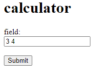

# Parcial 1 Arep

## Descripcion

Se pide realisar la construccion de una aplicacion web usando web sockets
que reciban una operacion matematica y una lista de parametros separados por coma
y retorna el valor correspondiente en formato JSON

## Arquitectura

Se describe la arquitecura de la aplicacion bajo tres componentes distribuidos:

1.) Una fachada web con sockets que se comunique con los servicios en el back

2.) Calculadora reflexiva, y un Algoritmo de bubblesort encargado de reordenar una lista de numeros 

3.) Cliente Wenb que hace las peticiones por medio de peticiones REST, enviando por parametro ya sean los numeros  calcular
o la lista de numero a reordenar por medio de este algoritmo

## Tecnologias usadas
- Java
- html
- js

